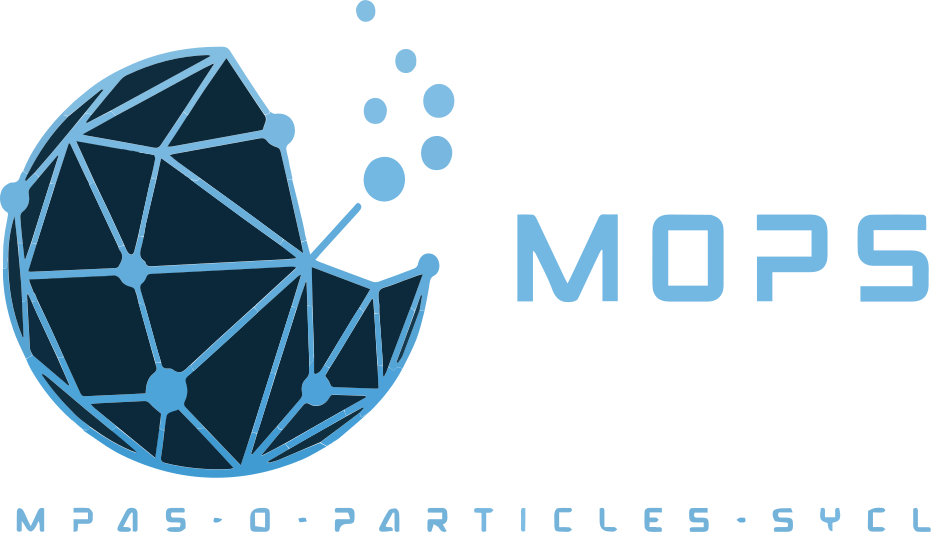
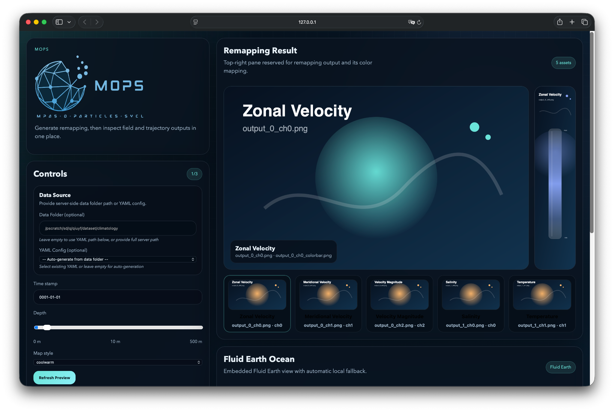
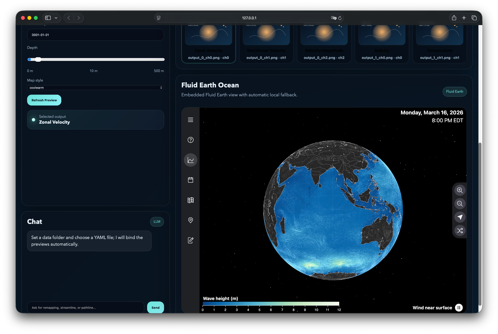

<a href="./LICENSE"></a>

## MOPS (MPAS-O-Particles-SYCL)
### MOPS (MPAS-Ocean Particle SYCL) is a command-line tool for simulating MPAS-Ocean trajectories, supporting visualization, particle sampling, and trajectory calculation.

## [📦 Installation](#-installation) | [💻 Command Line Interface](#-command-line-interface) | [📌 Examples](#-examples) | [🤖 LLM Task Agent](#-llm-task-agent) | [🌐 Frontend Visualization](#-frontend-visualization) | [⚙️ Default Parameter Values](#-default-parameter-values) | [📝 Notes](#-notes) | [📩 Contact](#-contact)


## 📦 Installation
### **1️⃣ Use CMake**
```bash
cd $PSCRATCH
git clone https://github.com/YosefQiu/MOPS.git
cd MOPS
# if want to use CUDA backend
source ./script/compiler_cuda.sh
# if want to use SYCL backend
source ./script/compiler_sycl.sh
# if want to use HIP backend
source ./script/compiler_hip.sh
# if want to use TBB backend
source ./script/compiler_tbb.sh
```
### **2️⃣ Use [Spack](https://github.com/spack/spack)** (will be update use a new repo)
> ### 🔗  check [spack_test](https://github.com/YosefQiu/spack_test) for more details.

## 💻 Command Line Interface

### **Usage**

```sh
./MOPS [OPTIONS]
```

### **Available Commands**
| **Command**  | **Description** |
|-------------|----------------|
| `MOPS`      | Parses input YAML and simulates MPAS-Ocean particle trajectories. |

### **CLI Options (It will be updated. Please refer to the tutorial folder for specific usage.)**
| **Option** | **Description** |
|------------|----------------|
| `-i, --input <file>` | **(Required)** Path to the input YAML configuration file. |
| `-p, --prefix <path>` | Data path prefix for additional resources. |
| `--imagesize <width> <height>` | Image size in pixels (`width` and `height`). Default: `360 x 180` |
| `--longitude <min> <max>` | Longitude range (`min` and `max`). Default: `-180 180` |
| `--latitude <min> <max>` | Latitude range (`min` and `max`). Default: `-90 90` |
| `--layer <layer> ` | Ocean layer. Default: `10` |
| `--depth <meter>` | Ocean depth in meter. Default: `800` |
| `--deltat <seconds>` | Time step (ΔT) in seconds. Default: `120` |
| `--checkt <seconds>` | Check interval in seconds. Default: `60` |
| `--trajectoryt <seconds>` | Total trajectory time in seconds. Default: `86400 (1 day)` |
| `--samplerange <lon_min> <lon_max> <lat_min> <lat_max>` | Sample range for longitude and latitude. Default: `-180 180 -90 90` |
| `--samplenumber <n>` | Number of samples to generate. Default: `100` |
| `--sampletype <type>` | Sampling type:<br> `uniform` - Uniform sampling <br> `gaussian` - Gaussian sampling <br> Default: `uniform` |
| `--visualizetype <type>` | Visualization type:<br> `remap` - Re-mapping visualization <br> `trajectory` - Trajectory visualization <br> Default: `remap` |
| `-h, --help` | Display this help message. |


## 📌 Examples
### 1️⃣ **Help infomation**
```bash
./MOPS -h
```
```bash
MPAS-Ocean Particle SYCL(MPOS) Command Line Parser
Usage:
  ./MOPS [OPTION...]

  -i, --input arg          Input YAML file (Required)
  -p, --prefix arg         Data path prefix
      --imagesize arg      Image Size (width height)
      --longitude arg      Longitude Range (min max)
      --latitude arg       Latitude Range (min max)
      --layer              Fixed Layer
      --depth              Fixed Depth
      --deltat arg         Delta T
      --checkt arg         Check T
      --trajectoryt arg    Trajectory T
      --samplerange arg    Sample Range (longitude_min longitude_max
                           latitude_min latitude_max)
      --samplenumber arg   Sample Number
      --sampletype arg     Sample Type (uniform or gaussian)
      --visualizetype arg  Visualize Type (remap or trajectory)
  -h, --help               Print help message
```
---

### 2️⃣ **Basic Execution**
```sh
./MOPS -i config.yaml
```
Uses default values for all parameters except the required input YAML file.

---
### 3️⃣ **Custom Image Size & Region**
```sh
./MOPS -i config.yaml --imagesize 1920 1080 --longitude -170 170 --latitude -80 80
```
Sets image size to `1920x1080` (width x height), longitude range to `-170 170`(170W -> 170E), and latitude range to `-80 80` (80S -> 80N).

---
### 4️⃣ **Custom Sampling & Visualization**
```sh
./MOPS -i config.yaml --samplenumber 500 --sampletype gaussian --visualizetype trajectory
```
Sets the sample number to `500`, uses Gaussian sampling, and selects trajectory visualization.

---

## 🤖 LLM Task Agent
### **Overview**
The LLM agent converts natural language requests into executable MOPS tasks (remapping, streamline, pathline).

### **Basic Usage**
```bash
cd /pscratch/sd/q/qiuyf/MOPS
python3 Agent/llm_task_agent.py \
  --request "Your natural language request here"
```

### **API Configuration**
The agent supports OpenAI-compatible APIs. Set your credentials:

**OpenAI:**
```bash
export OPENAI_API_KEY="your-key"
export OPENAI_BASE_URL="https://api.openai.com/v1"  # optional
```

**Foundry (recommended for NERSC):**
```bash
export FOUNDRY_BASE_URL="your-endpoint"  # or AZURE_INFERENCE_ENDPOINT
export FOUNDRY_API_KEY="your-key"        # or AZURE_OPENAI_API_KEY
export FOUNDRY_API_VERSION="2024-05-01-preview"  # optional
```

### **Example Commands**
```bash
# Remapping visualization
python3 Agent/llm_task_agent.py \
  --request "Create a 1201x601 remapping at 20m depth near Gulf of Mexico"

# Streamline analysis
python3 Agent/llm_task_agent.py \
  --request "Generate streamlines at 50 meters depth for 7 days"

# Pathline trajectory
python3 Agent/llm_task_agent.py \
  --request "Analyze particle trajectories from January 2015 to December 2015"

# Chinese language support
python3 Agent/llm_task_agent.py \
  --request "请帮我做墨西哥湾20米深度的重映射可视化"
```

### **CLI Options**
| **Option** | **Description** |
|------------|----------------|
| `--request <text>` | Natural language request describing the desired task |
| `--task <type>` | Force task type (remapping/streamline/pathline), skip LLM routing |
| `--dry-run` | Generate job files without executing |
| `--strict-llm` | Fail if LLM unavailable (no keyword fallback) |
| `--provider foundry` | Use Foundry API |
| `--model <name>` | Specify model/deployment name |
| `--output-dir <path>` | Custom output directory |

### **Generated Files**
- Config: `Agent/generated/config_<task>_*.json`
- Job script: `Agent/generated/job_<task>_*.py`
- Output: `Agent/outputs/<task>/`

---

## 🌐 Frontend Visualization
### **Overview**
The frontend visualization server provides an interactive web interface for exploring MOPS results.




### **Step 1: Start the Server on Perlmutter**
```bash
cd /pscratch/sd/q/qiuyf/MOPS/frontend

# Get the hostname of your compute node
hostname

# Start the server (runs on port 5000 by default)
./start_server.sh
```
Note the hostname output (e.g., `nid001234`).

### **Step 2: Set Up SSH Port Forwarding**
Open a **new terminal** on your local machine and run:
```bash
ssh -N -L 5000:<hostname>:5000 <username>@perlmutter.nersc.gov
```

Replace:
- `<hostname>`: The compute node hostname from Step 1 (e.g., `nid001234`)
- `<username>`: Your NERSC username

**Example:**
```bash
ssh -N -L 5000:nid001234:5000 qiuyf@perlmutter.nersc.gov
```

This command creates a tunnel and will not return (it stays running). Keep this terminal open.

### **Step 3: Access the Frontend**
Open your web browser and navigate to:
```
http://localhost:5000
```

The frontend should now be accessible from your local machine.

### **Troubleshooting**
- If port 5000 is already in use locally, change both port numbers:
  ```bash
  ssh -N -L 8000:<hostname>:5000 <username>@perlmutter.nersc.gov
  ```
  Then access `http://localhost:8000`
- Ensure your Perlmutter job has enough time allocation for the server session
- If connection drops, restart both the server and SSH tunnel

---

## ⚙️ Default Parameter Values
| **Parameter** | **Default Value** |
|--------------|------------------|
| `imagesize` | `360 x 180` |
| `longitude` | `-180 180` |
| `latitude` | `-90 90` |
| `layer` | `10` |
| `depth` | `800` |
| `deltat` | `120` |
| `checkt` | `60` |
| `trajectoryt` | `86400` |
| `samplerange` | `-180 180 -90 90` |
| `samplenumber` | `100` |
| `sampletype` | `uniform` |
| `visualizetype` | `remap` |

## 📝 Notes
- The `-i, --input` argument is **mandatory**; all other arguments are optional and default values will be used if not provided.
- Ensure that the input YAML file contains a valid MPAS-Ocean particle configuration.

### **Project Structure**
- `Agent/` - LLM task agent and job generation
- `frontend/` - Web visualization server
- `tutorial/` - Core MOPS tutorial examples
- `third_lib/` - Compiled MOPS libraries

## 📩 Contact
For questions or contributions, please reach out via **[qiu.722@osu.edu]**.


